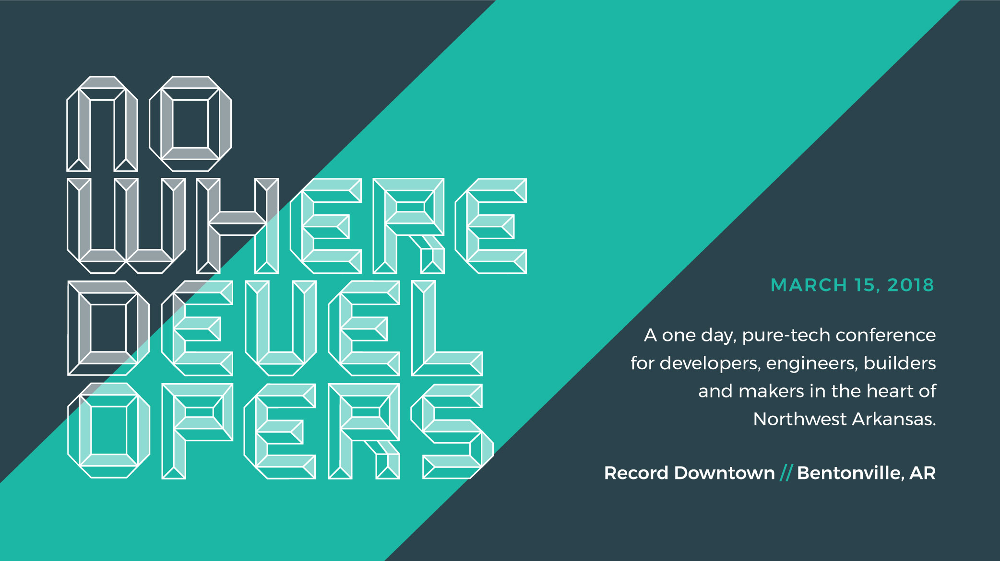

class: center, middle



---

# Fast, Beautiful, Reactive Dashboard Apps with Plotly Dash

## Introduction

- What is Plotly, and what is Dash?
- When to use, and when to skip?
- Tutorial

**Ask Questions Anytime Throughout the Talk**

???

We're going to talk about a piece of technology that we can use to build dashboards, or any analytics web application really.

Then I'll introduce the what Plotly and Dash are. Finally we'll talk about when to use and how to use.

---

# Plotly & Dash

Plotly is an easy-to-use charting library and company

- Any time of chart is available
- Easy to use, just plug in your data

Dash is a python wrapper around React, built for fast web apps

- Plug in any plotly chart
- Build web pieces with code
- Easy to use callbacks

---

#  When to use, when to skip?

## Pros:
- Very fast development and turnaround time
- Built-in integrations with different maps and all the types of charts
- Wraps around React

## Cons:
- Not as flexible as a customized solution
- Not good for large applications

Use for dashboards or analytics apps that need to be created quickly.  
Skip when you need a large application or guaranteed performance.

---

# Tutorial Part 1

Import necessary packages for Dash
Create the actual dash app which serves the content and handles callbacks

```python
import dash
import dash_core_components as dcc
import dash_html_components as html
import plotly.graph_objs as go

app = dash.Dash()
```

---

# Tutorial Part 2

Create a layout:

```python
app.layout = html.Div(
    [
        html.H1('Simple Title')
    ]
)
```

- Layout determines what HTML components are displayed on the webpage.
- Also includes things like graphs, input boxes, and other special pieces

---

# Tutorial Part 3

Adding a graph

```python
app.layout = html.Div([
    html.H1('Bitcoin Price over Time'),
    dcc.Graph(
        id='bitcoin-graph',
    )
])
```

- A graph can be any Plotly graph, from a map, to a line chart
- The actual graph is passed into a figure parameter

---

# Tutorial Part 4

```python
app.layout = html.Div([
    html.H1('Bitcoin Price over Time'),
    dcc.Graph(
        id='bitcoin-graph',
        figure=go.Figure(
            data=[
                go.Scatter(
                    x=time,
                    y=closingPrice,
                    name='Closing Price',
                    mode = 'lines'
                )
            ],
            layout=go.Layout(
                title='Bitcoin Closing Price versus Volume',
                yaxis=dict(
                    title='Price in USD'
                )
            )
        )
    )
])
```

---

# Callbacks

Callbacks handle events like a user clicking a button.

```python
@app.callback(
    Output(component_id='inventory_map', component_property='figure'),
    [Input(component_id='productMenu', component_property='value'),
     Input(component_id='regionMenu', component_property='value'),
    ]
)
def update_map(productValue, regionValue):
```

---

# Callbacks

```python
@app.callback(
    Output(component_id='inventory_map', component_property='figure'),
    [Input(component_id='productMenu', component_property='value'),
     Input(component_id='regionMenu', component_property='value'),
    ]
)
def update_map(productValue, regionValue):
    return map(data, demand, productList,
            productValue, storeList, regionValue,
            dc_info)
```

---

# Map with changing data

```python
def map(...):
    # Filter data based on user input

    return go.Figure(
        data=[go.Scattermapbox(
            text=text,
            ids=storeNumbers,
            lon=longitude,
            lat=latitude,
            name='Current In Stock',
            marker=go.Marker(
                opacity=0.5,
                size=markerSizes,
                sizemin=2,
                color=colors,
                colorscale=colorScale,
            )
        )]
    )
```

---

# Any Questions?

---
# Finale

**Check out https://plot.ly/dash/ for more tutorials and to try it out.**  

Stephen Ashmore ( stephen@supplypike.com ) for questions or comments.  

 

 